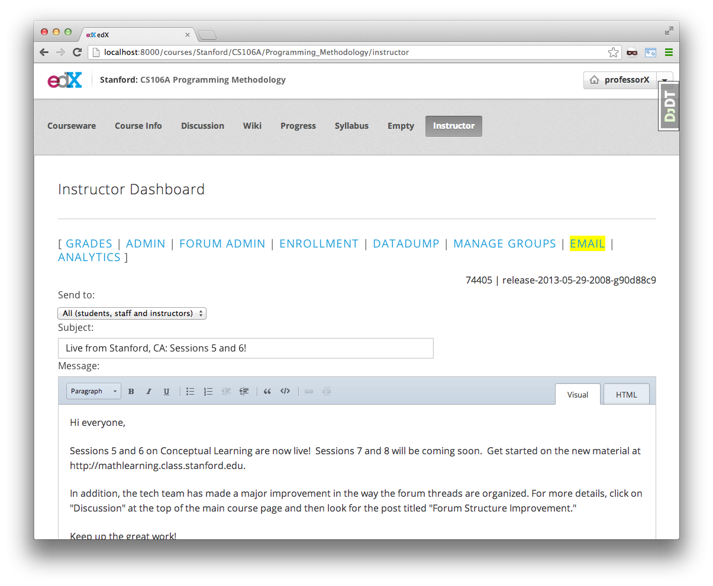
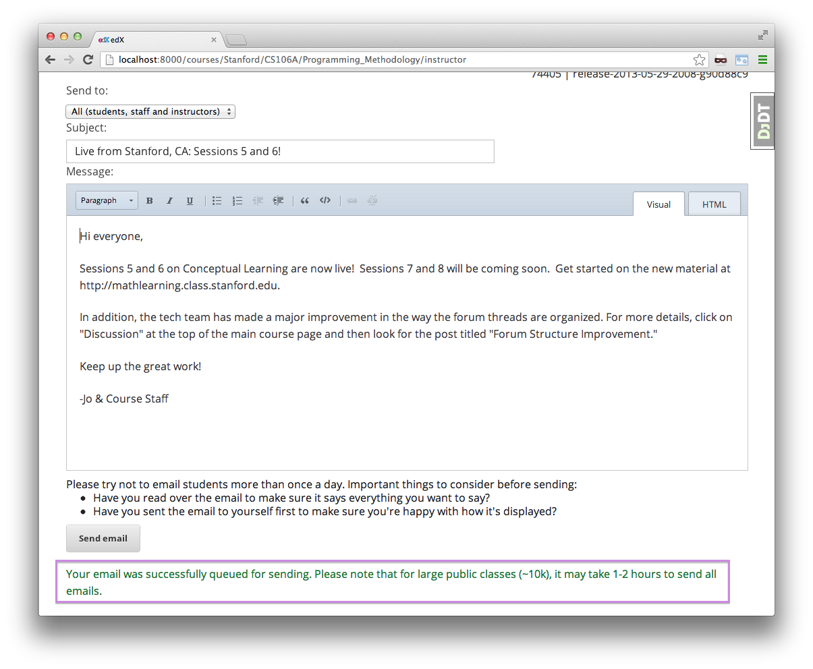

## Overview

Course staff can now compose emails and send them to course members.  The
key features are:

* Ability to compose HTML messages in the site.
 
* MIME multipart mails are sent, with auto-generated footer.
 
* Ability to efficiently to send to very large classes by fanning out
  jobs to worker machines over a job queue (celery).

* Mails are CAN-SPAM compliant: messages automatically have an optout link in the footer that directs them to the dashboard where users can set email settings for the course.

* Ability to opt out of receiving emails from individual courses.

The detailed stories for the feature are [here](https://docs.google.com/document/d/1s1Jq1SId-aeDV1XlW3Qoq9L9R0-UTkrO6XLqiTa0nRU/edit). Marketing mail is still to be done.

Credit goes to Jason Bau (<jbau@stanford.edu>) for developing the
feature in Class2Go.  Students Kevin Luo (<kevluo@stanford.edu>) and Akshay
Jagadeesh (<akshayj@berkeley.edu>) took that code and ported to OpenEdX over Summer
2013.

## Required Packages
* lynx: Used to convert HTML email to plaintext for multipart email.

## Known Issues

International Content - Unicode characters in the email subject and body is supported, but not in the recipient's name or the course title when included in the email footer. See [issue](https://github.com/Stanford-Online/edx-platform/issues/3).

## Feature Description

Instructors access the feature through the instructor dashboard by clicking the Email link,
which is toggled by the feature flag ENABLE_INSTRUCTOR_EMAIL. Instructors can select to send
themselves, staff and instructors, or everyone in the course (students, staff and instructors).
Sending to themself first is suggested to make sure the email looks as desired before sending
out to others. The HTML editor is ported from the Studio side to allow users to compose email
visually and/or the raw HTML. It is loaded as an XModule which brings along some unused code; eventually factoring out the editor as a self-contained library will be ideal.

After pressing Send email, a confirmation message is displayed at the bottom. This is currently the only feedback provided to the instructor; future work is needed for better feedback about email sending status, noted in the stories document.

## Backend

The djangoapp bulk_email handles the email-sending action by getting the recipient list and
batching the emails to different celery tasks to do the actual sending. The number of emails
each task sends is configurable with EMAILS_PER_TASK. It converts the HTML email to
plaintext using lynx for multipart emails, and appends a generated footer as seen in the screenshot below.
SMTP errors are handled appropriately by retrying or falling through to the next email. There are several configurable settings with defaults. DEFAULT_BULK_FROM_EMAIL specifies the from address for email. EMAIL_HOST, EMAIL_PORT, EMAIL_HOST_USER, EMAIL_HOST_PASSWORD, and EMAIL_USE_TLS are for the SMTP email backend
settings.

Any SMTP server may be specified for the email backend settings.
We use Amazon SES to send our mails.  We have SES configured to sign
messages on our behalf using DKIM to reduce the likelihood that they
will be treated by spam by the receiver.  Note the signature in the
following screenshot. See [here](http://docs.aws.amazon.com/ses/latest/DeveloperGuide/dkim.html) for more
information.

## Optouts

Users have the option to opt out of course specific emails in the user dashboard through an Email Settings link for each course.

