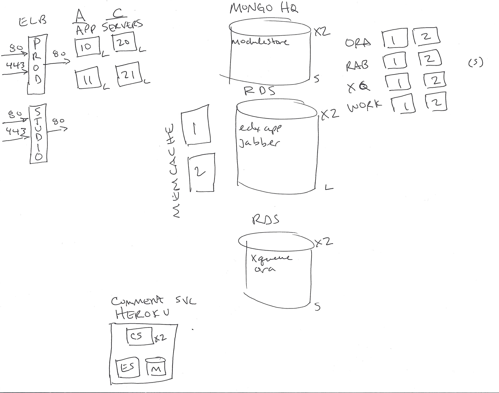
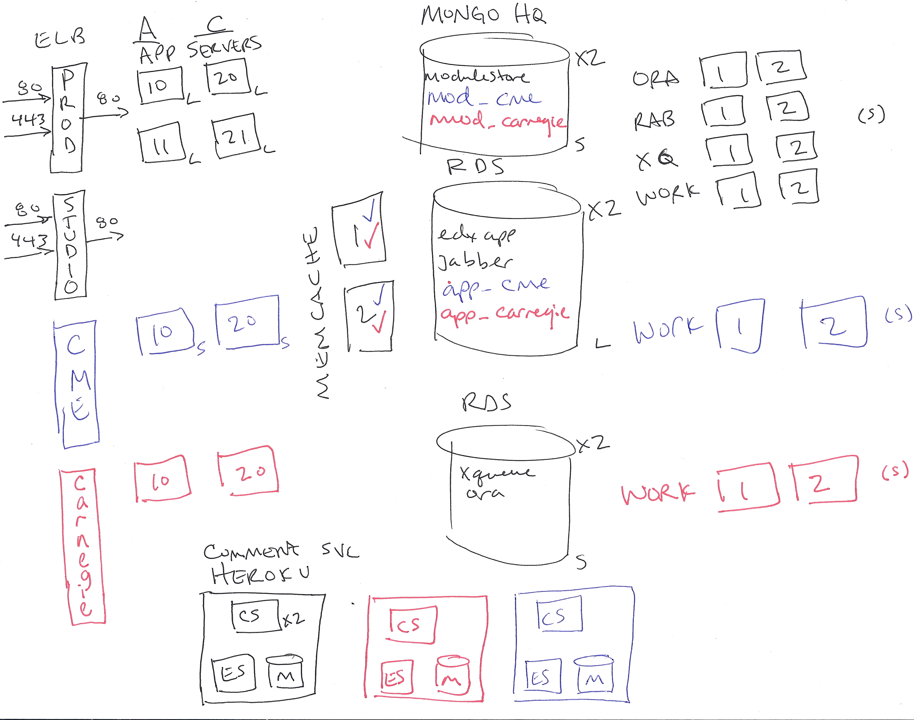

Instead of doing true multi-tenancy, this is an immediate solution
that will allow us to have multiple instances sharing much of the
infrastructure, without fully duplicated instances.

Stanford is doing this to support two additional instances. 

* [Stanford Continuing Medical Education][cme] - we plan to put up paid
  courses for the CME program, requiring a separate registration flow
  and separate class lists.  Do not want intermingling of accounts.

* [Carnegie Institution for Science][carn] - has nothing to do with CMU.
  They need separate branding.

  [cme]: http://cme.stanford.edu/
  [carn]: http://carnegiescience.edu/

Requirements
------------

Goals

1. Ability to support different themes
2. Data segregation
3. Done with what we have now
4. Course separation
5. Account separation

Non-Goals

1. Different code bases -- we want to install the same code to all instances
2. Shared everything
3. Full isolation

Proposal
========

Before Diagram
--------------

After Diagram
--------------

Note the additions for CME are in blue, Carnegie in red.

Issues
======

1. Shared Studio?  No, too weird, and "view live" gets exciting.

2. Redirects between instances?  Hope not.

8/13 Review Notes
=================

Jarv: why not just run separate silos (new cloudformation runs)?

Summary

1. Split frontends - OK

2. Shared databases with different instances -- fine, don't just separate instances, separate accounts as well

3. Shared memcache but with prefix key -- fine

4. Rabbit / celery - virtual hosts, OK

5. Separate workers - OK

6. Separate heroku - OK

  - 
